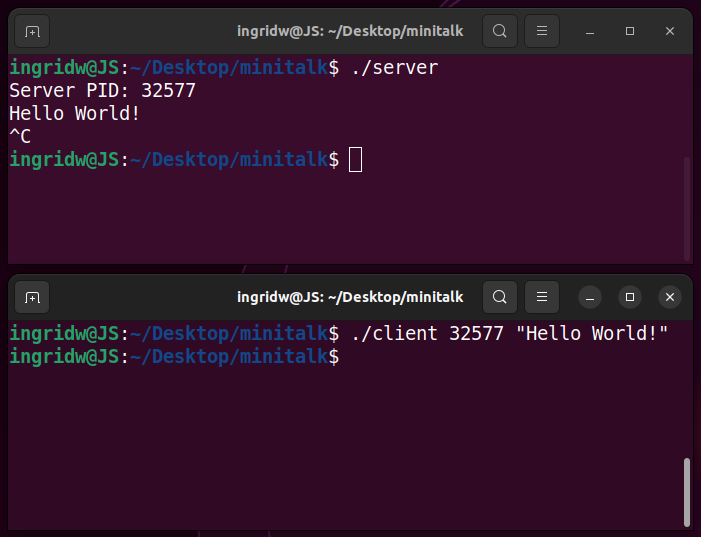

# 42 Cursus - minitalk


O objetivo deste projeto é implementar um sistema de comunicação entre dois processos utilizando `sinais UNIX`. Para isso são criados dois programas, sendo um o **client** e o outro o **server**, e eles comunicarão entre si através do envio de sinais e mensagens. O **client** enviará uma mensagem (codificação binária), para o **server**, que a recebe, decodifica e exibe na tela. É permitido o uso apenas dos sinais `SIGUSR1` e `SIGUSR2`, e das funções `signal` e `sigaction`.

## Bônus 

O bônus apenas faz com que o server envie um sinal de volta ao client quando a mensagem for recebida, e o client imprime uma mensagem de sucesso.

Também espera-se que possam ser enviados caracteres UTF-8 (que usa de 1 a 4 bytes), como por exemplo o `ç` ou emojis. No entanto, ao utilizar a função `write`, ela automaticamente faz o tratamento desses caracteres, fazendo com que este bônus seja concluído automaticamente.

## Compilação e Execução 

Para compilar a versão mandatória:

```
make
```

E para compilar a versão bônus:

```
make bonus
```

### Execução

Primeiramente é necessário executar o server no terminal:

```
./server
```

O programa continuará em execução para estar apto a receber mensagens.

Será exibida na tela uma numeração referente ao PID ("endereço" do server).

Abra outro terminal em paralelo e execute o client, enviando como parâmetro o PID gerado pelo server e a mensagem que deseja enviar:

```
./client 587 "Hello World!"
```

A mensagem será exibida no terminal onde o **server** está em execução.

Para encerrar o **server**, utilize o comando <kbd>Ctrl</kbd> + <kbd>C</kbd>.

## Notas

- O PID zero é reservado para o kernel.
- **SIGINT** é o sinal de `^C` (<kbd>Ctrl</kbd> + <kbd>C</kbd>).
- O sinal `^C` é o kernel quem envia.
- Para imprimir emojis há duas formas:
	- `./client <PID> 😊`
	- `echo -e '\xF0\x9F\x98\x8A' | xargs ./client`

## Visualização

<div align="center">



</div>
